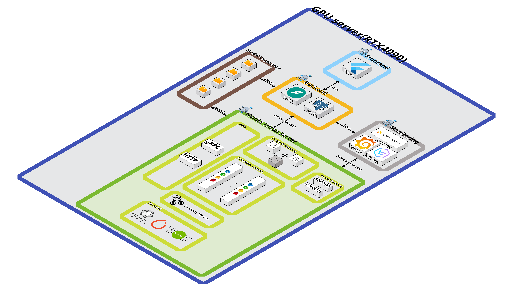

# Triton Inference Server 기반 AI 모델 배포 및 운영 시스템  
Backend / Monitoring / Triton / Frontend 통합 운영 플랫폼

## 1. Overview
이 프로젝트는 NVIDIA Triton Inference Server를 기반으로 AI 모델을 배포·운영·모니터링할 수 있는 통합 시스템입니다.  
Backend(FastAPI), Frontend(Flutter Web), Triton Server, PostgreSQL, ClickHouse, Vector, Prometheus로 구성되어 있으며, 오프라인(폐쇄망) 환경에서도 동작할 수 있도록 제작되었습니다.

### 주요 기능
- Triton Server 제어(Start / Stop / Restart)
- 모델 메타데이터 및 버전 관리
- 모델 설정(config) 이력 관리
- 추론 이력 관리
- Triton 로그 수집 및 조회 (일반/추론/에러 로그)
- GPU/CPU/RAM 실시간 모니터링
- SSE 기반 실시간 스트리밍

---

## 2. System Architecture

### 전체 아키텍처  


### 구성 요소
- **Frontend**: Flutter Web / Nginx  
- **Backend**: FastAPI 기반 Gateway API  
- **Inference Server**: NVIDIA Triton (HTTP/gRPC)  
- **DB**
  - PostgreSQL (업무 데이터)
  - ClickHouse (로그 데이터)
- **Monitoring**
  - Vector (Docker 로그 수집)
  - Prometheus (메트릭 수집)
- **Model Repository**  
  모델 파일 및 config 관리

---

## 3. Database Architecture

### 3.1 PostgreSQL ERD  
업무 데이터를 저장하는 핵심 스키마 구조입니다.

.png)

### 주요 테이블
- **users**: 사용자 계정, 권한  
- **models**: 모델 기본 정보  
- **model_versions**: 버전 관리  
- **model_configs**: Config 이력 관리  
- **model_releases**: 모델/Config 변경 이력  
- **server**: Triton 제어 기록  
- **inference_logs**: 추론 요청/결과 로그  

---

### 3.2 ClickHouse ERD  
Triton 로그 수집/분석용 로그 DB 구조입니다.

.png)

### 주요 로그 테이블
- **triton_logs**
  - Triton 일반 로그 저장  
- **triton_infer_logs**
  - 추론 관련 로그(request_id, model_name 포함)
- **triton_error_logs**
  - 에러 전용 로그 저장  

---

## 4. Project Structure (Backend)

```
S13P31S302
├─ Backend
│  ├─ .env
│  ├─ .flake8
│  ├─ .pre-commit-config.yaml
│  ├─ app
│  │  ├─ api
│  │  │  └─ v1
│  │  │     ├─ inferdata_router.py
│  │  │     ├─ log_router.py
│  │  │     ├─ masterkey_router.py
│  │  │     ├─ metrics_router.py
│  │  │     ├─ models_router.py
│  │  │     ├─ model_config_router.py
│  │  │     ├─ notification_router.py
│  │  │     ├─ router.py
│  │  │     ├─ server_router.py
│  │  │     ├─ standard_time_router.py
│  │  │     ├─ user_router.py
│  │  │     └─ __pycache__
│  │  │        ├─ gpu_router.cpython-312.pyc
│  │  │        ├─ masterkey_router.cpython-312.pyc
│  │  │        ├─ router.cpython-312.pyc
│  │  │        ├─ server_router.cpython-312.pyc
│  │  │        └─ user_router.cpython-312.pyc
│  │  ├─ clients
│  │  │  ├─ gpu_router.py
│  │  │  └─ triton_client.py
│  │  ├─ common
│  │  │  ├─ codes.py
│  │  │  ├─ messages.py
│  │  │  ├─ sse_base.py
│  │  │  ├─ sse_channels.py
│  │  │  ├─ sse_docker.py
│  │  │  ├─ sse_polling_channel.py
│  │  │  ├─ sse_push_channel.py
│  │  │  └─ utils.py
│  │  ├─ constants
│  │  │  └─ __pycache__
│  │  │     ├─ codes.cpython-312.pyc
│  │  │     └─ messages.cpython-312.pyc
│  │  ├─ core
│  │  │  ├─ config.py
│  │  │  ├─ customException.py
│  │  │  ├─ DB
│  │  │  │  ├─ clickhouse.py
│  │  │  │  └─ database.py
│  │  │  ├─ logger.py
│  │  │  ├─ response_utils.py
│  │  │  ├─ standard_time_manager.py
│  │  │  └─ __pycache__
│  │  │     ├─ config.cpython-311.pyc
│  │  │     ├─ config.cpython-312.pyc
│  │  │     ├─ customException.cpython-312.pyc
│  │  │     ├─ database.cpython-311.pyc
│  │  │     ├─ database.cpython-312.pyc
│  │  │     └─ response_utils.cpython-312.pyc
│  │  ├─ models
│  │  │  ├─ inference_logs.py
│  │  │  ├─ masterkey.py
│  │  │  ├─ model.py
│  │  │  ├─ model_config.py
│  │  │  ├─ server.py
│  │  │  ├─ user.py
│  │  │  └─ __pycache__
│  │  │     ├─ masterkey.cpython-312.pyc
│  │  │     ├─ server.cpython-312.pyc
│  │  │     └─ user.cpython-312.pyc
│  │  ├─ schemas
│  │  │  ├─ base_schema.py
│  │  │  ├─ inferoutput_schema.py
│  │  │  ├─ log_schema.py
│  │  │  ├─ masterkey_schema.py
│  │  │  ├─ model_config_schema.py
│  │  │  ├─ model_schema.py
│  │  │  ├─ server_schema.py
│  │  │  ├─ timeseries_schema.py
│  │  │  ├─ user_schema.py
│  │  │  └─ __pycache__
│  │  │     ├─ base_schema.cpython-312.pyc
│  │  │     ├─ masterkey_schema.cpython-312.pyc
│  │  │     ├─ server_schema.cpython-312.pyc
│  │  │     └─ user_schema.cpython-312.pyc
│  │  ├─ services
│  │  │  ├─ inferdata_service.py
│  │  │  ├─ log_service.py
│  │  │  ├─ masterkey_service.py
│  │  │  ├─ metrics_service.py
│  │  │  ├─ model_config_service.py
│  │  │  ├─ model_service.py
│  │  │  ├─ notification_service.py
│  │  │  ├─ server_service.py
│  │  │  ├─ user_service.py
│  │  │  └─ __pycache__
│  │  │     ├─ masterkey_service.cpython-312.pyc
│  │  │     ├─ server_service.cpython-312.pyc
│  │  │     └─ user_service.cpython-312.pyc
│  │  └─ state
│  │     └─ standard_state.json
│  ├─ Dockerfile
│  ├─ main.py
│  ├─ pyproject.toml
│  ├─ readme.md
│  ├─ requirements.txt
│  └─ __pycache__
│     ├─ main.cpython-311.pyc
│     └─ main.cpython-312.pyc
├─ Frontend
│  └─ readme.md
├─ README.md
└─ scripts
   └─ hooks
      └─ lint-commit-msg-config.sh

```

---

## 5. Key Features

### 5.1 Triton Server 제어
- Backend → docker CLI → Triton 컨테이너 제어  
- START / STOP / RESTART 수행  
- 모든 제어 이력은 `server` 테이블에 기록  

### 5.2 Model Management
- 모델 등록 / 삭제  
- 모델 버전 관리  
- 모델 설정(Config) 버전 관리  
- 모델·Config 변경 이력 기록(model_releases)

### 5.3 Inference Logging & Monitoring
- 모든 추론 요청이 `inference_logs`에 저장됨  
- 성공/실패 여부(request_status, inference_status) 확인 가능  
- 모델별 추론 성공률 및 추론 통계 조회  
- 에러 발생 시 ClickHouse의 `triton_error_logs`에서 상세 추적 가능  

### 5.4 실시간 서버 메트릭 조회
- GPU Utilization, GPU VRAM 사용률  
- CPU 사용률, RAM 사용량  
- Prometheus → Backend → SSE 기반 실시간 스트리밍  
- 대시보드에서 실시간 차트로 확인 가능  

### 5.5 Triton 로그 조회
- 일반 로그: `triton_logs`  
- 추론 로그: `triton_infer_logs`  
- 에러 로그: `triton_error_logs`  
- Vector가 Docker 로그 수집 → ClickHouse 저장  
- 시간 범위/모델명/레벨별 필터링 조회  

### 5.6 SSE 기반 실시간 데이터 스트리밍
- Triton 서버 상태 변화 실시간 반영  
- GPU/CPU/RAM 메트릭 실시간 업데이트  
- 추론 이벤트 및 서버 상태 알림(Notifications)

---

## 6. Deployment Structure

### Docker Compose 기반 멀티 스택
Backend / Triton / Monitoring을 분리하여 운영  
오프라인 환경에서도 설치 가능하도록 `.deb` 기반 docker installer 포함  

### 주요 포트
| 서비스 | 외부 포트 | 내부 포트 |
|--------|-----------|-----------|
| Frontend | 9005 | 80 |
| Backend | 9000 | 9000 |
| PostgreSQL | 9001 | 5432 |
| TRITON HTTP | 8000 | 8000 |
| TRITON gRPC | 8001 | 8001 |
| TRITON Metrics | 8002 | 8002 |
| ClickHouse | 9002 | 8123 |
| Prometheus | 9003 | 9090 |

---

## 7. How to Run (Offline Deployment)

### 1) 압축 해제
```
tar -xzf triton_inference_server_v1.0.tar.gz
```

### 2) Docker 설치 (오프라인)
```
sudo bash install_docker.sh
```

### 3) 전체 실행
```
bash RUN_ALL.sh
```

### 4) 접속 URL
- Frontend: http://<SERVER_IP>:9005  
- Backend Swagger: http://<SERVER_IP>:9000/docs  
- ClickHouse UI: http://<SERVER_IP>:9002  
- Prometheus: http://<SERVER_IP>:9003  


## 10. Tech Stack & Version Summary

### Core Versions
- Python: 3.12  
- FastAPI: 0.121.0  
- Uvicorn: 0.38.0  
- SQLAlchemy: 1.4.52  
- Pydantic: 2.12.3  

### Triton Inference Server
- Image: nvcr.io/nvidia/tritonserver:24.10-py3  
- CUDA: 12.7  
- NVIDIA Driver: 581.57  

### Databases
- PostgreSQL: 16  
- ClickHouse: latest (24.x 기준)

### Monitoring & Logging
- Prometheus: latest  
- Vector: latest-debian  

### Container Runtime
- Docker Engine: 29.0.1  
- Docker Compose: 2.40.3  

